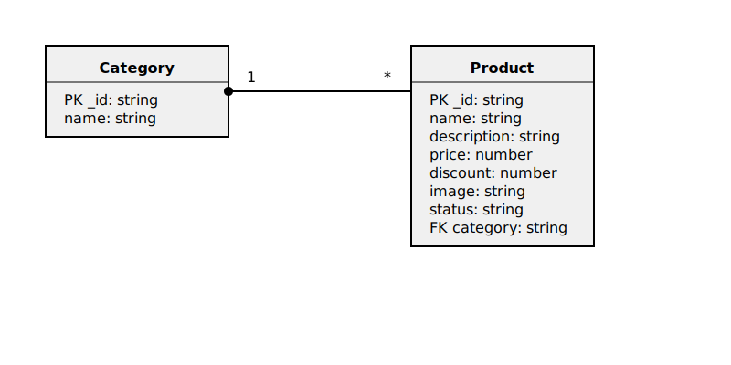
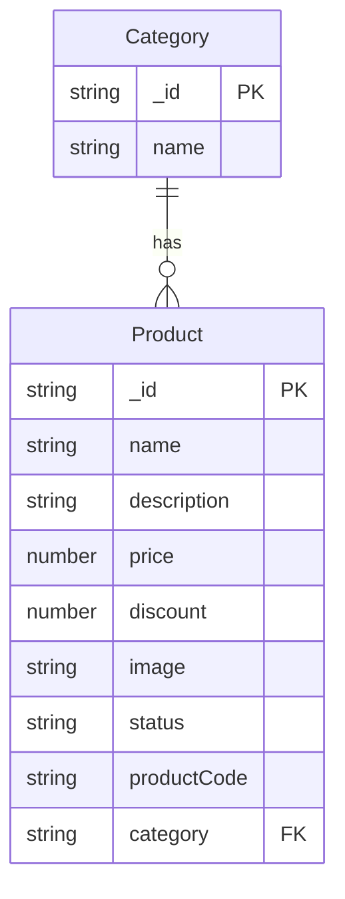

# E-Commerce Backend API

A robust backend API for an e-commerce platform built with TypeScript, Express.js, and MongoDB.

## Features

- Product management
- Category management
- Image upload with Cloudinary integration
- Type-safe development with TypeScript
- Error handling middleware
- Request validation

## Prerequisites

- Node.js (v14 or higher)
- MongoDB
- TypeScript

## Installation

1. Clone the repository:
```bash
git clone https://github.com/Meherab151175/e-com.git>
cd e-com
```

2. Install dependencies:
```bash
npm install
```

3. Create a `.env` file in the root directory and add your environment variables:
```env
PORT=5000
MONGODB_URI=your_mongodb_connection_string
CLOUDINARY_CLOUD_NAME=your_cloudinary_cloud_name
CLOUDINARY_API_KEY=your_cloudinary_api_key
CLOUDINARY_API_SECRET=your_cloudinary_api_secret
```

## Development

Start the development server:
```bash
npm run dev
```

Build for production:
```bash
npm run build
```

Start production server:
```bash
npm start
```

## Database Schema

### ER Diagram


### Schema Details


## Project Structure

```
src/
├── app.ts           # Express app configuration
├── server.ts        # Server entry point
├── config/          # Configuration files
├── middleware/      # Custom middleware
├── module/          # Feature modules (products, categories)
└── utils/           # Utility functions
```

## API Endpoints

### Products
- `GET /api/v1/product` - Get all products
- `POST /api/v1/product/create-product` - Create a new product (requires image file upload)
- `PUT /api/v1/product/:id` - Update a product

### Categories
- `POST /api/v1/category/create-category` - Create a new categor


